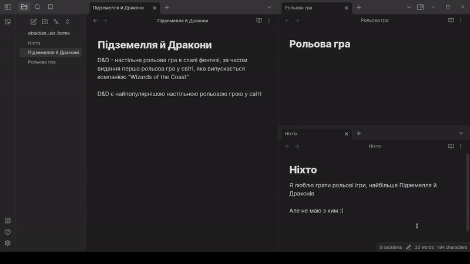

# Word Case Linker

An Obsidian plugin to find unlinked mentions in different cases to the name of the note (e.g. `octopi` can be linked to `octopus`)

At the moment, the plugin only works for Ukrainian words, but it can be extended to other languages by implementing a stemmer for them

